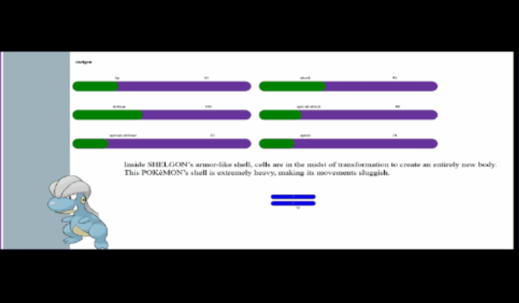

# Competitive-Pokedex

The competitive pokedex helps you discover new pokemons and inform your team building decision through useful stats.

## About  
The Competitive-Pokedex provides  
1)An index system for accessing pokemon information  
2)A team builder that shows you the relative weakness and resistance of your team  
3)Ranking of pokemons in terms of their base stats(hp, attack, defense, special)  
4)Individual comparison option between pokemons  

Competitive-Pokedex gathers its information on pokemons through api calls to https://pokeapi.co/

## Feature screenshots
Pokedex list


## How to use(user)
site: [competitivePokedex](https://competitive-pokedex-nu.vercel.app/)

## How to use(developer)
switch to my_app directory   
```bash
cd my_app/
```  
run the development server
```bash
npm run dev
# or
yarn dev
# or
pnpm dev
# or
bun dev

```


## plan
-list page(a list of customizeable number of pokemons displayed like a table)  
:white_check_mark: individual pokemon display(features name and sprite)  
:white_check_mark: list that has a slider for adjusting number of pokemon displayed  
:white_large_square: more detailed pokemon display(displays description and base stat)  
:white_large_square: more detailed pokemon display (displays description and base stat)
:white_large_square: more detailed pokemon display (displays description and base stat)

## issues
:white_check_mark: sometimes pokemon description is in a language other than English  
⬜ redering many pokemons causes long loading time
